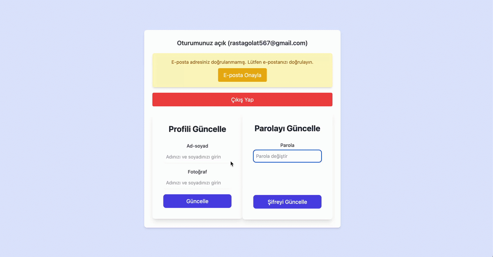

# Firebase Authentication with Redux Toolkit and Tailwind CSS

## 📖 Overview
This project demonstrates a Firebase Authentication workflow integrated with Redux Toolkit for state management and Tailwind CSS for styling. It provides user-friendly authentication features such as login, registration, and password updates.

## 🚀 Features
- **User Registration**: Create new accounts with `createUserWithEmailAndPassword`.
- **User Login**: Authenticate users with `signInWithEmailAndPassword`.
- **Logout**: End user sessions with `signOut`.
- **Real-Time Auth State**: Monitor authentication state changes using `onAuthStateChanged`.
- **Profile Updates**: Update user information using `updateProfile`.
- **Password Management**: Change user passwords with `updatePassword`.
- **Email Verification**: Send verification emails with `sendEmailVerification`.

## 🛠️ Technologies Used
- **Firebase**: Authentication services and real-time database.
- **Redux Toolkit**: Centralized state management.
- **Tailwind CSS**: Utility-first CSS framework for responsive design.
- **React**: Frontend library for building UI.

<----------   gif loading please wait...  --------->
# firebase-y-a
# firebase-y-a
